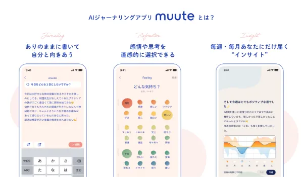
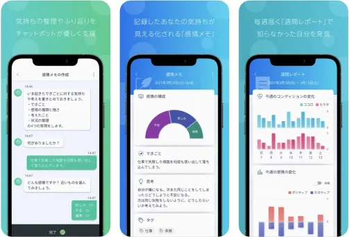

# Competitive Analysis

## 比較サマリー

| アプリ | 累計DL | 価格（年額） | 推定年間売上 |
|--------|--------|--------------|--------------|
| **muute** | 160万 | ¥5,000〜6,000 | 1.8〜4.8億円 |
| **Awarefy** | 80万 | ¥9,600〜19,000 | 1.2〜3.6億円 |
| **毎日まめ** | 1,000万+ | ¥2,600 | 数千万〜1.2億円 |
| **Daylio** | 1,000万+ | ¥3,600 | 0.9〜1.8億円 |
| **Finch** | 1,500万+ | ¥5,300 | **36〜50億円** |

※売上は推定値。利益は非公開のため記載なし。muute・Awarefyは課金率2〜5%で試算。

## 開発体制まとめ

| アプリ | 運営会社 | 本社 | 従業員数 | 資金調達 |
|--------|----------|------|----------|----------|
| **muute** | ミッドナイトブレックファスト | 渋谷 | **5〜10名** | 推定44〜46億円 |
| **Awarefy** | 株式会社Awarefy | 日本 | 24〜50名 | 7.2億円 |
| **毎日まめ** | BlueSignum Corp. | 韓国ソウル | 小規模 | シード（Google Accelerator参加） |
| **Daylio** | Relaxio / Habitics | チェコ | 小規模 | ブートストラップ（推定） |
| **Finch** | Finch Care PBC | 米国カリフォルニア | 小規模 | シード〜シリーズA（推定） |

## 各アプリ詳細

### 🇯🇵 muute（ミュート）

https://muute.jp/

**概要:** 日本のAIジャーナリング市場でトップ。160万DL、App Store★4.7。10代〜20代女性中心。

| 項目 | データ |
|------|--------|
| 累計DL | **160万**（ほぼ日本） |
| 資金調達 | 推定44〜46億円 |
| 価格 | 無料 / 月額¥500〜980 / 年額¥5,000〜6,000 |
| App Store | ★4.7（1.9万件） |
| 推定年間売上 | 1.8〜4.8億円 |
| 運営 | ミッドナイトブレックファスト（2019年設立、渋谷） |

**主要機能:**
- 自由記述ジャーナリング
- AI感情分析・週次/月次レポート
- 可愛らしいUIデザイン




### 🇯🇵 Awarefy（アウェアファイ）

https://www.awarefy.com/

**概要:** CBT（認知行動療法）ベースのメンタルヘルスアプリ。80万DL、医師92%推奨。B2B展開も強い。

| 項目 | データ |
|------|--------|
| 累計DL | **80万**（大部分が日本） |
| 資金調達 | **7.2億円**（シリーズA 4億円含む） |
| 価格 | 無料 / ベーシック¥1,600 / AIパートナー¥4,480 |
| App Store | ★4.3（5,000件超）、トップセールス16位 |
| 推定年間売上 | 1.2〜3.6億円 |
| 運営 | 株式会社Awarefy（2018年設立、従業員24〜50名） |

**主要機能:**
- 感情記録・分析
- AIチャット相談（ファイさん）
- マインドフルネス瞑想
- CBTプログラム



### 🇰🇷 毎日まめ（DailyBean）

**概要:** 韓国発の可愛い気分トラッカー。**日本市場で最大級**（300〜400万DL、レビュー7.1万件）。

| 項目 | データ |
|------|--------|
| 累計DL | **1,000万+**（全世界） |
| 日本DL | **300〜400万**（全体の30〜40%） |
| 価格 | 無料 / 月額¥480 / 年額¥2,600 |
| App Store（日本） | ★4.8（**7.1万件**） |
| Google Play（日本） | ★4.6（18.5万件） |
| 推定年間売上 | 数千万〜1.2億円 |
| 運営 | BlueSignum Corp.（韓国ソウル、2019年設立） |

**日本での成功要因:**
- 可愛い豆キャラクター
- 完全日本語対応（Instagram運用も日本語）
- **低価格**（年額¥2,600はmuuteの半額以下）
- タップだけで記録完了のシンプルUX


### 🌍 Daylio

https://daylio.net/

**概要:** チェコ発の気分トラッカー。**文字入力不要**でアイコンタップだけ。グローバル1,000万DL+。

| 項目 | データ |
|------|--------|
| 累計DL | **1,000万+**（Google Play）、日本50〜100万（推定） |
| 価格 | 無料 / 月額¥480 / 年額¥3,600 |
| App Store（日本） | ★4.7（8,800件） |
| 推定年間売上 | 0.9〜1.8億円 |
| 運営 | Relaxio / Habitics（チェコ） |

**主要機能:**
- アイコン選択で感情・活動を記録（テキスト不要）
- **「この活動をすると気分が上がる」を統計で可視化**
- 広告なし無料版
- 詳細な統計・グラフ


**君のアプリとの関連:**
- 「過去データから傾向を分析」という点が近い
- ただしDaylioは**分析で止まる**（行動提案はしない）

### 🌍 Finch

https://finchcare.com/

**概要:** 米国発の**ペット育成×セルフケア**アプリ。グローバル1,500〜1,800万DL、**月間売上3〜4億円**。

| 項目 | データ |
|------|--------|
| 累計DL | **1,500〜1,800万**（iOS + Android） |
| 日本DL | **15〜50万**（推定、発展途上） |
| 価格 | 無料 / 月額¥880 / 年額¥5,300 / 買い切り¥10,000 |
| 推定年間売上 | **36〜50億円** |
| App Store（全世界） | ★4.9（39万件） |
| App Store（日本） | ★4.9（2.6万件） |
| 日本語対応 | ◎ 完全対応（2023年〜） |
| 運営 | Finch Care PBC（米国カリフォルニア） |

**主要機能:**
- バーチャルペット（小鳥）を育成
- 日々の目標設定・達成でペットが成長
- セルフケアのルーティン形成
- ADHD・不安症サポート機能


**君のアプリとの関連:**
- **ゲーミフィケーション**で行動を促す点が近い
- 「遅延割引対策」として参考になる

## ポジショニングマップ

```
                    AI活用度 高
                        ↑
                        │
            Awarefy ●───┼───● muute
                        │
                        │     ★ 自分のアプリ
                        │
  シンプル ←────────────┼────────────→ 多機能
                        │
         毎日まめ ●     │     ● Finch
                        │
              Daylio ●  │
                        │
                        ↓
                    AI活用度 低
```

**自分のアプリの位置:**
- AI活用度：高（過去データからパーソナライズ提案）
- 機能性：中程度（シンプルUIだが行動提案まで踏み込む）

## 市場の結論

### 日本市場ランキング

**ダウンロード数（日本推定）:**
1. 🥇 **毎日まめ**: 300〜400万DL
2. 🥈 **muute**: 160万DL
3. 🥉 **Daylio**: 50〜100万DL
4. **Awarefy**: 80万DL
5. **Finch**: 15〜50万DL

**App Storeレビュー数（日本）:**
1. 🥇 **毎日まめ**: 7.1万件
2. 🥈 **Finch**: 2.6万件
3. 🥉 **muute**: 1.9万件
4. **Daylio**: 8,800件
5. **Awarefy**: 5,000件

### 価格帯比較

| アプリ | 年額 | 月額換算 |
|--------|------|----------|
| **毎日まめ** | ¥2,600 | ¥217 |
| **Daylio** | ¥3,600 | ¥300 |
| **Finch** | ¥5,300 | ¥442 |
| **muute** | ¥5,000〜6,000 | ¥417〜500 |
| **Awarefy** | ¥9,600〜19,000 | ¥800〜1,583 |

### 競合との違い

| 観点 | 競合アプリ | 自分のアプリ |
|------|------------|--------------|
| **AIの役割** | 分析する / 記録を整理 | **行動を提案する** |
| **データ活用** | 感情パターンを可視化 | **過去の成功体験から具体的行動を提示** |
| **ユースケース** | 振り返り・記録 | **「めんどい」瞬間に即サポート** |
| **アプローチ** | 記録 → 分析 | **記録 → 分析 → 行動提案** |

### 独自の強み

1. **「過去の自分が助けてくれる」体験**
   - 競合：AIが一般的なアドバイス or 分析のみ
   - 自分：自分の過去の成功体験ベース

2. **「めんどい」に特化したUI**
   - 競合：ジャーナリング/感情記録がメイン
   - 自分：行動できない瞬間に寄り添う

3. **遅延割引への対策**（Finchから学べる）
   - 「終わった後の気持ち」を可視化
   - 超具体的ステップに分解
